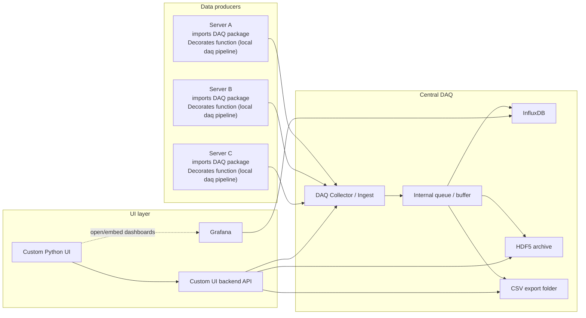

# h2pcontrol-daq

This is the daq (data acquisition) component of the h2pcontrol system. It is responsible for acquiring data from various sensors and devices,
and sending it to the h2pcontrol-daq server for processing, storage and UI.

There are two parts of this project, the first one is the h2pcontrol-daq server [`h2pcontrol-daq/server`], which is responsible for receiving data from the device servers and processing it,
and the second one is the h2pcontrol-daq package [`h2pcontrol-daq/lib`], which is responsible for giving an easy interface to the device servers to send data to the h2pcontrol-daq server.

## Installation for the package

For the installation of the python package (the `h2pcontrol-daq/lib`), you just have to do the following and the package will be installed:

```bash
pip install git+https://github.com/iic201/h2pcontrol-daq.git#subdirectory=lib
```

It can be installed like this because it is released on Github. If you wan to install from a specific version, you can do it like this:

```bash
pip install git+https://github.com/iic201/h2pcontrol-daq.git@v1.0.0#subdirectory=lib
```

For a description of the current local DAQ implementation, see [lib/readme-local-daq.md](lib/readme-local-daq.md).

## Design

The design and interaction between the components of the h2pcontrol-daq system and the h2pcontrol is as follows:



Each server imports the lib package (`h2pcontrol-daq/lib`) and uses it to decorate the functions. This decorator then creates a local pipeline for the data
(see the `h2pcontrol-daq/lib/pipeline.py` file for more details) and sends the data to the central DAQ server (`h2pcontrol-daq/server`).
Note that this part of sending it to the central DAQ is optional, and the local pipeline can be used without sending it to the central DAQ server.
However, if the data is sent to the central DAQ server, it will be processed and stored in the central InfluxDB, HDF5 archive and CSV export folder.
For now, the central pipeline subscribes to the producer UI broadcaster, relays those events into the central ingest queue, and then the ingest layer stores them in the central InfluxDB, HDF5 archive and CSV export folder.
The UI layer then interacts with the central DAQ server to retrieve the data and display it to the user. Grafana is used to visualize the data from the InfluxDB, while the custom Python UI can retrieve data from the central DAQ server and display it in a custom way.
