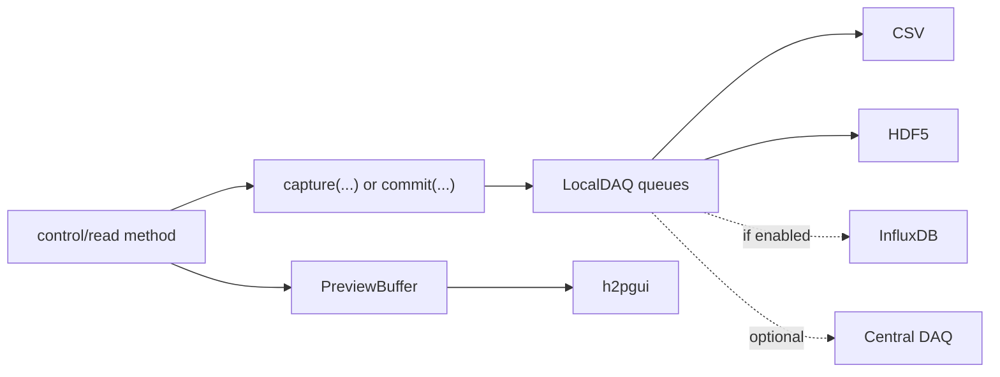

# h2pcontrol-daq

`h2pcontrol-daq` contains the DAQ tools used by H2PControl instrument servers:

- `lib/`: Python package with `LocalDAQ`, `capture`, and preview buffering
- `central-server/`: optional central DAQ gRPC receiver
- `gui/`: generic preview GUI for servers that expose `h2pcontrol.gui.v2.GuiService`

## Repository Layout

```text
h2pcontrol-daq/
├── lib/               # LocalDAQ package
├── central-server/    # Optional central DAQ receiver on port 50052
├── gui/               # h2pgui preview application
└── README.md
```

## Local DAQ Package

Install the package from this repository:

```bash
uv add "h2pcontrol-daq @ git+https://github.com/iic201/h2pcontrol-daq.git#subdirectory=lib"
```

Install a specific tag:

```bash
uv add "h2pcontrol-daq @ git+https://github.com/iic201/h2pcontrol-daq.git@v1.0.0#subdirectory=lib"
```

Main exports:

```python
from h2pcontrol_daq import (
    LocalDAQ,
    capture,
    DAQConfig,
    DAQSaveFormat,
    OverflowPolicy,
    PreviewBuffer,
    PreviewFrame,
)
```

### Basic Use

```python
from h2pcontrol_daq import DAQConfig, LocalDAQ, capture

daq = LocalDAQ(
    DAQConfig(
        save_formats=("csv", "influx"),
        influxdb_url="http://localhost:8086",
        influxdb_token="...",
        influxdb_org="beyer-labs",
        influxdb_bucket="h2pcontrol",
    )
)

await daq.start()

@capture(daq, source="counter", direction="both")
async def ReadCounter(self, request, context):
    ...

await daq.stop()
```

`await daq.start()` starts the background writer tasks. `await daq.stop()` flushes the queues and closes writers.

### Save Formats

`DAQConfig.save_formats` is the set of formats enabled for this `LocalDAQ` instance. The default is CSV only.

Supported values are:

- `"csv"`
- `"hdf5"`
- `"influx"`

The enum values `DAQSaveFormat.CSV`, `DAQSaveFormat.HDF5`, and `DAQSaveFormat.INFLUX` also work.

Per-event `save_formats` on `commit`, `commit_preview`, or `@capture` may choose a subset of the configured formats:

```python
daq = LocalDAQ(DAQConfig(save_formats=("csv", "hdf5", "influx")))

daq.commit(
    source="counter",
    method="manual_capture",
    data={"value": 42},
    save_formats=("csv",),
)

@capture(daq, source="field", save_formats=("hdf5", "influx"))
async def ReadField(self, request, context):
    ...
```

If an event asks for a format that was not enabled in `DAQConfig.save_formats`, `LocalDAQ` raises `ValueError`. Use `save_formats=()` to skip local file/Influx writes for a specific event.

### Local Files

Files are written relative to the server process working directory:

```text
data/csv/daq_capture_<run_id>.csv
data/hdf5/daq_capture_<run_id>.hdf5
.logs/daq-info.log
.logs/daq-error.log
```

The `run_id` is generated once per Python process unless a caller passes one explicitly.

### Local InfluxDB

Enable local InfluxDB writes by including `"influx"` in `DAQConfig.save_formats`.

Influx settings can be passed in `DAQConfig` or environment variables:

```text
INFLUXDB_URL
INFLUXDB_TOKEN or INFLUXDB_ADMIN_TOKEN
INFLUXDB_ORG
INFLUXDB_BUCKET
INFLUXDB_MEASUREMENT_PREFIX
```

Measurements are named `<measurement_prefix>_<source>`, for example `daq_counter`. Base event fields and event `tags` become Influx tags. Only finite numeric and boolean measurement values are written as fields.

## Preview Buffer

`PreviewBuffer` keeps the latest GUI-facing measurement frames and recent history per source.

```python
preview = preview_buffer.update(
    source="magnetic_field",
    producer_id="mmc3416-bfield-monitor",
    data={"state": state_dict},
    metadata={"proto": "mmc3416.v1.Mmc3416State"},
)
```

Instrument servers convert `PreviewFrame`s into `h2pcontrol.gui.v2.Frame` messages for the GUI. GUI `SaveInterval` handlers can commit selected preview frames through `daq.commit_preview(...)`.

## GUI

Run the generic preview GUI:

```bash
uv --project gui run h2pgui
```

Connect directly to a service:

```bash
uv --project gui run h2pgui --target 127.0.0.1:5055
```

Use a non-default manager address:

```bash
uv --project gui run h2pgui --manager-addr 127.0.0.1:50051
```

The GUI can discover services, stream preview frames, plot numeric values, save a local selection, and call the server's `SaveInterval` RPC.

Local GUI exports are written under:

```text
data/gui_exports/<target_ip_port>/<source>_<timestamp>_<start>_<end>/
```

## Central DAQ Server

Run the optional central DAQ receiver:

```bash
uv --project central-server run python main.py
```

Instrument-side `LocalDAQ` streams to it when `DAQConfig.enable_central_stream=True`.

Central InfluxDB settings are read from environment variables or `.env` files:

```text
INFLUXDB_URL
INFLUXDB_ADMIN_TOKEN
INFLUXDB_ORG
INFLUXDB_BUCKET
INFLUXDB_MEASUREMENT_PREFIX
```

Setup helper:

```text
central-server/scripts/influxdb_setup.py
```

## Data Flow



## Notes

- `capture(...)` supports sync and async methods.
- The central server and GUI are optional.
- Local files are still written when central streaming is disabled.
