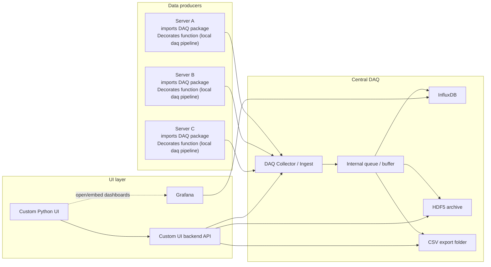

# h2pcontrol-daq

This is the daq (data acquisition) component of the h2pcontrol system. It is responsible for acquiring data from various sensors and devices,
and sending it to the h2pcontrol-daq server for processing, storage and UI.

There are two parts of this project, the first one is the h2pcontrol-daq server [`h2pcontrol-daq/server`], which is responsible for receiving data from the device servers and processing it,
and the second one is the h2pcontrol-daq package [`h2pcontrol-daq/lib`], which is responsible for giving an easy interface to the device servers to send data to the h2pcontrol-daq server.

## Installation for the package

For the installation of the python package (the `h2pcontrol-daq/lib`), you just have to do the following and the package will be installed:

```bash
pip install git+https://github.com/iic201/h2pcontrol-daq.git#subdirectory=lib
```

It can be installed like this because it is released on Github. If you wan to install from a specific version, you can do it like this:

```bash
pip install git+https://github.com/iic201/h2pcontrol-daq.git@v1.0.0#subdirectory=lib
```

## Design

The design and interaction between the components of the h2pcontrol-daq system and the h2pcontrol is as follows:



Each server imports the lib package (`h2pcontrol-daq/lib`) and uses it to decorate the functions. This decorator then creates a local pipeline for the data
(see the `h2pcontrol-daq/lib/pipeline.py` file for more details) and sends the data to the central DAQ server (`h2pcontrol-daq/server`).
Note that this part of sending it to the central DAQ is optional, and the local pipeline can be used without sending it to the central DAQ server.
However, if the data is sent to the central DAQ server, it will be processed and stored in the central InfluxDB, HDF5 archive and CSV export folder.
For now, the central pipeline subscribes to the producer UI broadcaster, relays those events into the central ingest queue, and then the ingest layer stores them in the central InfluxDB, HDF5 archive and CSV export folder.
The UI layer then interacts with the central DAQ server to retrieve the data and display it to the user. Grafana is used to visualize the data from the InfluxDB, while the custom Python UI can retrieve data from the central DAQ server and display it in a custom way.

## Test 

There is also some test code in the `test` folder, which is used to test the functionality of the package and the server. The `instrument_server.py` file is a simple example of a server that uses the DAQ package and runs the pipeline and no one subscribes to the UI events.

To make lifes easier when testing locally here are some commands to run the influxdb and grafana:

1. First of all install grafana and influxdb on your local machine for macOS you can use homebrew:

```bash
brew install grafana
brew install influxdb
```
2. Then you can run the influxdb and grafana servers:

```bash
brew services start influxdb
brew services start grafana
```

3. Then you need to figure out where each of them is running, for influxdb it is usually `http://localhost:8086` and for grafana it is usually `http://localhost:3000`. If these are not the correct urls, you can run:

```bash
# To check that they are running
brew services list
# And to check the ports they are running on respectively
lsof -i | grep influxdb
lsof -i | grep grafana
```

4. Then you need to create a token for the influxdb, you can do it by running the following command:

```bash 
influxdb3 create token --admin
#after check the health of the influxdb server with
curl -H "Authorization: Bearer YOUR_TOKEN" http://localhost:8181/health
```

5. After that you can run the `instrument_server.py` file to test the functionality of the package and the server. If you wan to test more the grafana part you can create a database and a table in the influxdb and then create a dashboard in grafana to visualize the data from the influxdb. These are the following commands to do that:

```bash
# Create a database/bucket in influxdb
influxdb3 create database test --token YOUR_ADMIN_TOKEN
#Create a table (tables in the influxdb are created automatically when you write data to them, so you can just write data to a table and it will be created)
influxdb3 write \
  --database test \
  --token YOUR_ADMIN_TOKEN \
  "your_table_name,tag1=value field1=1.0"
```

### Grafana

Open grafana. Go to Connections → Data Sources → Add data source, select InfluxDB and configure:

```md
Query Language: InfluxQL
URL: http://localhost:8181
Database: test
Token: paste your admin token in the Authorization header field as:
     Token YOUR_ADMIN_TOKEN
Click Save & Test
```

#### Build a Dashboard

Go to Dashboards → New → Add visualization. Select your InfluxDB data source. Write a query (here is a simple query):

```sql
sqlSELECT * FROM "your_table_name" WHERE time > now() - 1h
```