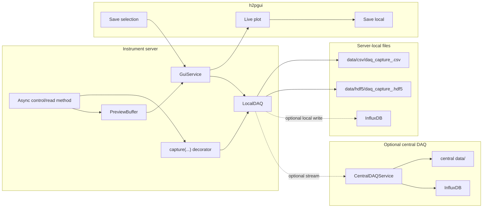

# h2pcontrol-daq

`h2pcontrol-daq` contains the DAQ-side tools used by H2PControl servers:

- a reusable Python package for local capture and preview buffering (`lib/`)
- an optional central DAQ gRPC receiver (`central-server/`)
- a generic preview GUI for servers that implement `h2pcontrol.gui.v2.GuiService` (`gui/`)

The current project is not one monolithic server. Instrument servers usually import the `lib/` package, expose their own control gRPC service, optionally expose `GuiService` for live preview, and can stream committed events to the central DAQ.

## Repository Layout

```text
h2pcontrol-daq/
├── lib/               # Python package: LocalDAQ, capture decorator, preview buffer
├── central-server/    # Optional central DAQ gRPC ingest service on port 50052
├── gui/               # h2pgui preview application
└── README.md
```

## Local DAQ Package

The package in `lib/` is installed by instrument servers that want local capture, local persistence, GUI preview buffering, and optional streaming to central DAQ.

Install from this repository:

```bash
uv add "h2pcontrol-daq @ git+https://github.com/iic201/h2pcontrol-daq.git#subdirectory=lib"
```

Install a specific tag:

```bash
uv add "h2pcontrol-daq @ git+https://github.com/iic201/h2pcontrol-daq.git@v1.0.0#subdirectory=lib"
```

Main exports:

```python
from h2pcontrol_daq import (
    LocalDAQ,
    capture,
    DAQConfig,
    OverflowPolicy,
    PreviewBuffer,
    PreviewFrame,
)
```

Typical use:

```python
from h2pcontrol_daq import LocalDAQ, capture

daq = LocalDAQ()

@capture(daq, source="counter", direction="both")
async def read_counter(...):
    ...
```

Start the background writer tasks when your server starts:

```python
await daq.start()
```

Stop and flush queues during shutdown:

```python
await daq.stop()
```

### Local Files

`LocalDAQ` writes under the current working directory of the process using it:

```text
data/csv/daq_capture_<run_id>.csv
data/hdf5/daq_capture_<run_id>.hdf5
.logs/daq-info.log
.logs/daq-error.log
```

The `run_id` is generated once per Python process. Decorated captures and manual GUI/preview commits now use the same generated run id unless a caller explicitly passes one.

By default, `LocalDAQ` writes CSV and HDF5. Choose different formats globally with
`DAQConfig.save_formats`:

```python
from h2pcontrol_daq import DAQConfig, DAQSaveFormat, LocalDAQ

daq = LocalDAQ(
    DAQConfig(
        save_formats=(DAQSaveFormat.HDF5,),  # or ("hdf5",)
    )
)
```

You can also override formats for a single manual commit, preview commit, or capture
decorator:

```python
daq.commit(
    source="counter",
    method="manual_capture",
    data={"value": 42},
    save_formats=("csv", "influx"),
)
```

Supported save formats are `csv`, `hdf5`, and `influx`.

Format behavior:

- CSV flattens nested event data into columns such as `data.preview.state.value`.
- HDF5 stores event metadata as attributes and nested event data as groups/datasets.

### Local InfluxDB Writes

`LocalDAQ` can also write committed events directly to a local or reachable InfluxDB instance. It is disabled by default. Enable it for every event with `enable_local_influx=True` or include `DAQSaveFormat.INFLUX` in `save_formats`:

```python
from h2pcontrol_daq import DAQConfig, LocalDAQ

daq = LocalDAQ(
    DAQConfig(
        enable_local_influx=True,
        influxdb_url="http://localhost:8086",
        influxdb_token="...",
        influxdb_org="beyer-labs",
        influxdb_bucket="h2pcontrol",
    )
)
```

These values can also come from environment variables:

```text
INFLUXDB_URL
INFLUXDB_TOKEN or INFLUXDB_ADMIN_TOKEN
INFLUXDB_ORG
INFLUXDB_BUCKET
INFLUXDB_MEASUREMENT_PREFIX
```

Local Influx measurements are named `<measurement_prefix>_<source>`, for example `daq_counter`. Run/source/method metadata and event-level `tags` are written as InfluxDB tags. To keep the time-series schema compact, only finite numeric and boolean measurement values are written as fields; bulky descriptive subtrees such as `analysis`, `metadata`, and board/static info stay in JSONL/CSV/HDF5.

See [lib/readme-local-daq.md](lib/readme-local-daq.md) for the local DAQ flow in more detail.

## Preview Buffer

`PreviewBuffer` is a lightweight in-memory buffer used by instrument servers to keep the latest GUI-facing measurement frames.

It stores:

- latest frame per source
- recent history per source
- monotonically increasing sequence IDs per source

Servers use it like this:

```python
preview = preview_buffer.update(
    source="magnetic_field",
    producer_id="mmc3416-bfield-monitor",
    data={"state": state_dict},
    metadata={"proto": "mmc3416.v1.Mmc3416State"},
)
```

Instrument servers then convert these `PreviewFrame`s into `h2pcontrol.gui.v2.Frame` messages for the GUI.

## GUI

The GUI package in `gui/` provides `h2pgui`, a generic live preview app for servers that expose:

```proto
h2pcontrol.gui.v2.GuiService
```

Run from the repository:

```bash
uv --project gui run h2pgui
```

Connect directly to a GUI service:

```bash
uv --project gui run h2pgui --target 127.0.0.1:5055
```

Use a non-default manager address for service discovery:

```bash
uv --project gui run h2pgui --manager-addr 127.0.0.1:50051
```

The GUI can:

- discover registered services through the h2pcontrol manager
- connect directly to a target address
- stream scalar, vector, array, or struct-like preview frames
- plot numeric values over time
- select a time interval on the plot
- ask the server to save that interval with `SaveInterval`
- save the selected GUI buffer locally with `Save local`
- calculate a trapezoidal integral over the selected time interval
- start/stop the GUI's local preview stream subscription

Local GUI exports are written where `h2pgui` is running:

```text
data/gui_exports/<target_ip_port>/<source>_<timestamp>_<start>_<end>/
├── frames.csv
└── integral.csv
```

Remote `Save selection` is different: it calls the server's `SaveInterval` RPC and the server commits selected preview frames through its own `LocalDAQ`.

## Central DAQ Server

`central-server/` contains an optional central gRPC receiver for committed DAQ events. It listens on port `50052` by default:

```bash
uv --project central-server run python main.py
```

Instrument-side `LocalDAQ` can stream events to it through `GrpcDAQSink` when `DAQConfig.enable_central_stream` is enabled.

The current central service:

- implements `h2pcontrol.central_daq.v1.CentralDAQService/StreamDAQEvents`
- ingests streamed DAQ events into async queues
- writes CSV and HDF5 under `central-server/data/<source>/...`
- attempts to write to InfluxDB using configuration from `.env`

InfluxDB settings are read from environment variables or `.env` files:

```text
INFLUXDB_URL
INFLUXDB_ADMIN_TOKEN
INFLUXDB_ORG
INFLUXDB_BUCKET
INFLUXDB_MEASUREMENT_PREFIX
```

There is a setup helper under:

```text
central-server/scripts/influxdb_setup.py
```

## Current Data Flow



## Notes

- The local DAQ package targets async producer methods.
- The central server is optional. Local files are still written even when central streaming is disabled.
- The GUI is generic and optional. Servers can implement `GuiService` for live preview without using the local DAQ features, or use the local DAQ without implementing `GuiService` and streaming to the GUI.xs
